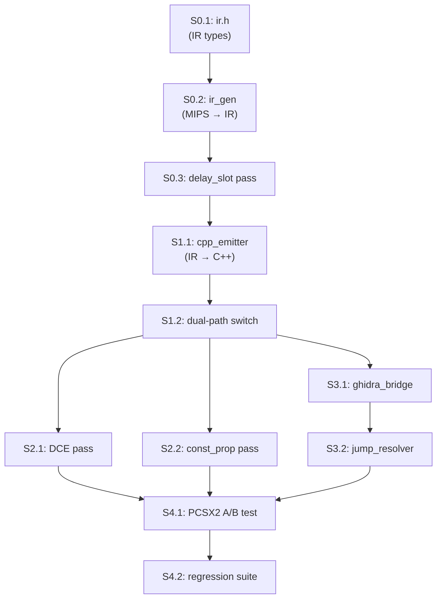

# Concrete Execution Roadmap — PS2reAIcomp

> **Prerequisite**: Approved [implementation_plan.md](file:///C:/Users/sebas/.gemini/antigravity/brain/76fd3c28-5068-42ed-9b91-8e34cabe5b38/implementation_plan.md)
> **Workspace**: `e:\Programmi VARI\PROGETTI\PS2reAIcomp`  
> **Baseline Fork**: `RESWIII-PS2recomp\ps2xRecomp` (existing codebase we're modifying)

---

## Sprint 0 — Scaffolding & IR Foundation (Week 1)

**Goal**: Insert the IR layer between `r5900_decoder` and `code_generator` without breaking the existing pipeline.

### S0.1 — IR Type Definitions

#### [NEW] `include/ps2recomp/ir.h`

Define the SSA IR node types that map 1:1 to R5900 semantics:

```cpp
// Core IR types:
enum class IROp {
    // ALU (word/dword)
    ADD_W, ADDU_W, SUB_W, SUBU_W, ADD_D, ADDU_D, SUB_D, SUBU_D,
    AND, OR, XOR, NOR,
    SLT, SLTU,
    SLL, SRL, SRA, SLLV, SRLV, SRAV,
    DSLL, DSRL, DSRA, DSLL32, DSRL32, DSRA32,
    DSLLV, DSRLV, DSRAV,
    LUI,
    
    // Multiply/Divide → LO/HI
    MULT, MULTU, DIV, DIVU,
    MADD, MADDU,       // MMI
    MULT1, MULTU1, DIV1, DIVU1, MADD1, MADDU1, // MMI pipeline 1
    MFHI, MTHI, MFLO, MTLO,
    MFHI1, MTHI1, MFLO1, MTLO1,
    
    // 128-bit MMI (SIMD 4×32, 8×16, 16×8)
    PADDW, PSUBW, PADDH, PSUBH, PADDB, PSUBB,
    PCGTW, PCEQW, PCGTH, PCEQH, PCGTB, PCEQB,
    PMAXW, PMINW, PMAXH, PMINH,
    PEXTLW, PEXTUW, PEXTLH, PEXTUH, PEXTLB, PEXTUB,
    PPACW, PPACH, PPACB,
    PCPYLD, PCPYUD, PCPYH,
    PSLLW, PSRLW, PSRAW, PSLLH, PSRLH, PSRAH,
    PAND, POR, PNOR, PXOR,
    QFSRV,
    PLZCW,
    MFSA, MTSA, MTSAB, MTSAH,
    PINTH, PINTEH,
    PROT3W, PREVH, PEXEW, PEXEH, PEXCW, PEXCH,
    PMADDW, PMSUBW, PMULTW, PDIVW,
    PMADDH, PHMADH, PMSUBH, PHMSBH, PMULTH, PDIVBW,
    PMADDUW, PMULTUW, PDIVUW,
    PMFHI, PMFLO, PMTHI, PMTLO,
    PMFHL, PMTHL,
    PABSW, PABSH, PADSBH,
    PADDUW, PSUBUW, PADDUH, PSUBUH, PADDUB, PSUBUB,
    PADDSW, PSUBSW, PADDSH, PSUBSH, PADDSB, PSUBSB,
    PEXT5, PPAC5,
    PSLLVW, PSRLVW, PSRAVW,
    MOVZ, MOVN,
    
    // Memory (word widths: B, BU, H, HU, W, WU, WL, WR, D, DL, DR, Q)
    LOAD_B, LOAD_BU, LOAD_H, LOAD_HU,
    LOAD_W, LOAD_WU, LOAD_WL, LOAD_WR,
    LOAD_D, LOAD_DL, LOAD_DR, LOAD_Q,
    STORE_B, STORE_H, STORE_W, STORE_WL, STORE_WR,
    STORE_D, STORE_DL, STORE_DR, STORE_Q,
    
    // FPU (single-precision only on R5900)
    FPU_ADD, FPU_SUB, FPU_MUL, FPU_DIV, FPU_SQRT, FPU_RSQRT,
    FPU_ABS, FPU_NEG, FPU_MOV,
    FPU_CVT_S_W, FPU_CVT_W_S,
    FPU_ROUND_W, FPU_TRUNC_W, FPU_CEIL_W, FPU_FLOOR_W,
    FPU_ADDA, FPU_SUBA, FPU_MULA, FPU_MADDA, FPU_MSUBA,
    FPU_MADD, FPU_MSUB,
    FPU_MAX, FPU_MIN,
    FPU_MFC1, FPU_MTC1, FPU_CFC1, FPU_CTC1,
    FPU_LWC1, FPU_SWC1,
    FPU_C_EQ, FPU_C_LT, FPU_C_LE, FPU_C_F,  // comparison subset
    
    // COP0  
    COP0_MFC0, COP0_MTC0,
    COP0_ERET, COP0_EI, COP0_DI,
    COP0_TLBR, COP0_TLBWI, COP0_TLBWR, COP0_TLBP,
    
    // VU0 Macro — data transfer
    VU0_QMFC2, VU0_QMTC2, VU0_CFC2, VU0_CTC2,
    VU0_LQC2, VU0_SQC2,
    // VU0 Macro — ALU (Special1 table: ~60 ops)
    VU0_VADD, VU0_VSUB, VU0_VMUL,
    VU0_VMADD, VU0_VMSUB,
    VU0_VMAX, VU0_VMINI,
    VU0_VADDA, VU0_VSUBA, VU0_VMULA, VU0_VMADDA, VU0_VMSUBA,
    VU0_VOPMULA, VU0_VOPMSUB,
    VU0_VDIV, VU0_VSQRT, VU0_VRSQRT,
    VU0_VITOF0, VU0_VITOF4, VU0_VITOF12, VU0_VITOF15,
    VU0_VFTOI0, VU0_VFTOI4, VU0_VFTOI12, VU0_VFTOI15,
    VU0_VABS, VU0_VMOVE, VU0_VMR32,
    VU0_VLQI, VU0_VSQI, VU0_VLQD, VU0_VSQD,
    VU0_VMFIR, VU0_VMTIR,
    VU0_VILWR, VU0_VISWR,
    VU0_VIADD, VU0_VISUB, VU0_VIADDI, VU0_VIAND, VU0_VIOR,
    VU0_VCALLMS, VU0_VCALLMSR,
    VU0_VWAITQ, VU0_VNOP,
    VU0_VCLIPW,
    VU0_VRINIT, VU0_VRGET, VU0_VRNEXT, VU0_VRXOR,
    
    // Control flow
    BR,           // unconditional (j, b)
    BR_EQ, BR_NE, BR_LEZ, BR_GTZ, BR_LTZ, BR_GEZ,
    BR_LIKELY_EQ, BR_LIKELY_NE, BR_LIKELY_LEZ, BR_LIKELY_GTZ,
    BR_LIKELY_LTZ, BR_LIKELY_GEZ,
    CALL,         // jal
    CALL_REG,     // jalr
    JUMP_REG,     // jr (non-ra = indirect, ra = return)
    RETURN,       // jr $ra
    SYSCALL,
    BREAK_,
    
    // COP1 branches
    BR_FPU_TRUE, BR_FPU_FALSE,
    BR_LIKELY_FPU_TRUE, BR_LIKELY_FPU_FALSE,
    
    // COP2 branches
    BR_VU0_TRUE, BR_VU0_FALSE,
    BR_LIKELY_VU0_TRUE, BR_LIKELY_VU0_FALSE,
    
    // Traps
    TRAP_GE, TRAP_GEU, TRAP_LT, TRAP_LTU, TRAP_EQ, TRAP_NE,
    TRAP_GEI, TRAP_GEIU, TRAP_LTI, TRAP_LTIU, TRAP_EQI, TRAP_NEI,
    
    // Pseudo
    NOP,
    SYNC, CACHE, PREF,
    
    // Meta (for IR bookkeeping)
    LABEL,        // basic block entry
    PHI,          // SSA φ-node
    COMMENT,
};
```

Key types in the same header:

```cpp
struct IRValue {
    uint32_t id;          // SSA value number
    enum { GPR128, FPR32, ACC32, VU128, VU_I16, CTRL32, IMM32, IMM16 } type;
};

struct IRNode {
    IROp op;
    IRValue dst;           // destination SSA value
    IRValue src[3];        // up to 3 source operands
    uint32_t origAddress;  // MIPS PC for debugging
    uint8_t vuDest;        // VU destination mask (xyzw)
    uint8_t vuBcField;     // VU broadcast field (x/y/z/w)
};

struct IRBasicBlock {
    uint32_t startAddress;
    std::vector<IRNode> nodes;
    std::vector<uint32_t> successors;  // block IDs
    std::vector<uint32_t> predecessors;
};

struct IRFunction {
    uint32_t entryAddress;
    std::string name;
    std::vector<IRBasicBlock> blocks;
};
```

> [!IMPORTANT]
> The `IROp` enum must cover **every instruction** the existing `CodeGenerator::translate*` methods handle. The list above is derived from [code_generator.h](file:///E:/Programmi%20VARI/PROGETTI/RESWIII-PS2recomp/ps2xRecomp/include/ps2recomp/code_generator.h) methods and [instructions.h](file:///E:/Programmi%20VARI/PROGETTI/RESWIII-PS2recomp/ps2xRecomp/include/ps2recomp/instructions.h) enums.

**Test**: Header compiles cleanly — `#include "ir.h"` in a test [.cpp](file:///E:/Programmi%20VARI/PROGETTI/PS2Recomp/ps2xRuntime/src/main.cpp).

---

### S0.2 — IR Generator (MIPS → IR Translation)

#### [NEW] `src/lifter/ir_gen.h` + `src/lifter/ir_gen.cpp`

A class `IRGenerator` that takes a `std::vector<Instruction>` (existing type from [types.h](file:///E:/Programmi%20VARI/PROGETTI/RESWIII-PS2recomp/ps2xRecomp/include/ps2recomp/types.h)) and produces an `IRFunction`:

```cpp
class IRGenerator {
public:
    IRFunction lift(const Function& func, const std::vector<Instruction>& instructions);
    
private:
    IRValue nextValue();  // SSA value counter
    void liftInstruction(const Instruction& inst, IRBasicBlock& block);
    
    // Per-opcode group (parallel to CodeGenerator::translate* methods):
    void liftSpecial(const Instruction& inst, IRBasicBlock& block);
    void liftRegimm(const Instruction& inst, IRBasicBlock& block);
    void liftMMI(const Instruction& inst, IRBasicBlock& block);
    void liftCOP0(const Instruction& inst, IRBasicBlock& block);
    void liftCOP1(const Instruction& inst, IRBasicBlock& block);
    void liftCOP2(const Instruction& inst, IRBasicBlock& block);
    void liftMemory(const Instruction& inst, IRBasicBlock& block);
    void liftBranch(const Instruction& inst, IRBasicBlock& block);
    
    // Branch delay slot resolution:
    void resolveBranchDelaySlots(IRFunction& func);
};
```

**Key design rule**: The `liftInstruction` method does a `switch(opcode)` that mirrors the existing [r5900_decoder.cpp](file:///E:/Programmi%20VARI/PROGETTI/PS2Recomp/ps2xRecomp/src/lib/r5900_decoder.cpp)'s [decode()](file:///E:/Programmi%20VARI/PROGETTI/PS2Recomp/ps2xRecomp/src/lib/r5900_decoder.cpp#417-514) path, but instead of calling `CodeGenerator::translate*()`, it emits `IRNode`s into the basic block.

**Test**: Lift a hand-crafted [Function](file:///E:/Programmi%20VARI/PROGETTI/RESWIII-PS2recomp/ps2xRecomp/include/ps2recomp/types.h#84-96) with known instructions → verify `IRFunction` has correct `IROp` sequence.

---

### S0.3 — Delay Slot Resolution Pass

#### [NEW] `src/lifter/passes/delay_slot.h` + `src/lifter/passes/delay_slot.cpp`

Operates on `IRFunction`. For each branch `IRNode`:
1. Find the instruction immediately after it (the delay slot)
2. **Normal branch**: Move the delay slot node *before* the branch node
3. **Branch-likely**: Wrap the delay slot inside the branch's taken-path block
4. **JR/JALR in delay slot of another branch**: Error/flag (extremely rare)

This replaces [handleBranchDelaySlots](file:///E:/Programmi%20VARI/PROGETTI/RESWIII-PS2recomp/ps2xRecomp/include/ps2recomp/code_generator.h) in the existing code generator.

**Test**: IR with `[ADD_W, BR_EQ, ADD_W]` → after pass: `[ADD_W, ADD_W_delay, BR_EQ]` with correct SSA values.

---

## Sprint 1 — Backend: IR → C++ Emitter (Week 2)

**Goal**: Generate the same C++ output as the existing [CodeGenerator](file:///E:/Programmi%20VARI/PROGETTI/PS2Recomp/ps2xRecomp/src/lib/code_generator.cpp#102-110), but from IR nodes.

### S1.1 — C++ Emitter

#### [NEW] `src/backend/cpp_emitter.h` + `src/backend/cpp_emitter.cpp`

```cpp
class CppEmitter {
public:
    std::string emit(const IRFunction& func);
    
private:
    std::string emitNode(const IRNode& node);
    std::string emitALU(const IRNode& node);
    std::string emitMemory(const IRNode& node);
    std::string emitBranch(const IRNode& node);
    std::string emitFPU(const IRNode& node);
    std::string emitMMI(const IRNode& node);
    std::string emitVU0(const IRNode& node);
    std::string emitCOP0(const IRNode& node);
};
```

Each `emitXxx()` method produces the same C++ text that the existing `CodeGenerator::translateXxx()` would. This is a **mechanical translation** — the output format doesn't change yet.

**Test**: For 5 representative functions (`GamePush`, `PAK_init`, `SceneConstructor`, etc.):
  - Old pipeline: `Instruction → CodeGenerator → C++`
  - New pipeline: `Instruction → IRGenerator → CppEmitter → C++`
  - Diff the outputs — they must be semantically identical.

---

### S1.2 — Integration Point: Dual-Path Switch

#### [MODIFY] `src/recompiler.cpp` or equivalent entry point

Add a CLI flag `--use-ir` (default: off) that switches between:
- **Old path**: `Analyzer → CodeGenerator` (existing, unchanged)
- **New path**: `Analyzer → IRGenerator → [passes] → CppEmitter`

This means the existing pipeline is **never broken**. The new path can be tested in parallel.

**Test**: `ps2xRecomp.exe --elf SLES_531.55 --use-ir` produces equivalent output to the existing mode.

---

## Sprint 2 — Optimization Passes (Week 3)

### S2.1 — Dead Code Elimination (DCE)

#### [NEW] `src/lifter/passes/dce.cpp`

Remove IR nodes whose `dst` value is never consumed by any subsequent node. Eliminates NOP padding and dead `$zero` writes.

### S2.2 — Constant Propagation

#### [NEW] `src/lifter/passes/const_prop.cpp`

Track `LUI + ORI` / `LUI + ADDIU` pairs → resolve to constant. Propagates through `ADD_W` with known operands. Critical for resolving `jr $t9` targets statically.

### S2.3 — SIMD Folding (Future)

#### [NEW] `src/lifter/passes/simd_fold.cpp`

Detect sequences of scalar loads (`lw × 4`) that can be fused into a single `lq` when addresses are 16-byte aligned. **This is a stretch goal.**

**Test per pass**: Unit tests with crafted IR → verify node count reduction.

---

## Sprint 3 — Ghidra Frontend Integration (Week 4)

**Goal**: Replace the heuristic function boundary detector with Ghidra MCP analysis.

### S3.1 — Ghidra Bridge

#### [NEW] `src/frontend/ghidra_bridge.h` + `src/frontend/ghidra_bridge.cpp`

Uses the Ghidra MCP tools (already available in this workspace) to:
1. `functions_list()` → enumerate all functions with boundaries
2. `functions_decompile(addr)` → get CFG per function
3. `xrefs_list(to_addr)` → resolve cross-references for jump tables
4. `data_list_strings()` → identify string literals

Output: `std::vector<Function>` with accurate `startAddress`, `endAddress`, [name](file:///E:/Programmi%20VARI/PROGETTI/PS2Recomp/ps2xRecomp/src/lib/code_generator.cpp#111-115), and `isManuallyIdentified` flags.

### S3.2 — Jump Table Resolver

#### [NEW] `src/frontend/jump_resolver.cpp`

For `jr $reg` patterns (not `jr $ra`):
1. Backward data flow from Ghidra MCP's `get_dataflow(address, "backward")`
2. If `lui + ori + jr` pattern → constant target, add to function map
3. If jump table pattern (indexed load from `.rodata`) → enumerate all targets
4. Otherwise → flag for runtime indirect dispatch

**Test**: Against known jump tables in SW EP3 identified via PCSX2 breakpoints.

---

## Sprint 4 — Verification & Regression (Week 5)

### S4.1 — PCSX2 A/B Equivalence Tester

#### [NEW] `scripts/semantic_equivalence_test.py`

For a given function address:
1. Use PCSX2 MCP to set breakpoint at entry
2. Capture register state on break
3. Step through function (or run to return)
4. Capture output register state
5. Run the recompiled C++ version with same input registers
6. Compare output registers

### S4.2 — SW EP3 Regression Suite

Ensure the existing 30+ frame boot still works with the new IR path enabled.

---

## Dependency Graph



---

## Existing Files Impact Matrix

| Existing File | Action | What Changes |
|---|---|---|
| [types.h](file:///E:/Programmi%20VARI/PROGETTI/RESWIII-PS2recomp/ps2xRecomp/include/ps2recomp/types.h) | **NO CHANGE** | IR types go in new `ir.h` |
| [instructions.h](file:///E:/Programmi%20VARI/PROGETTI/RESWIII-PS2recomp/ps2xRecomp/include/ps2recomp/instructions.h) | **NO CHANGE** | IR enums reference these, don't duplicate |
| [r5900_decoder.h/cpp](file:///E:/Programmi%20VARI/PROGETTI/RESWIII-PS2recomp/ps2xRecomp/include/ps2recomp/r5900_decoder.h) | **NO CHANGE** | IRGenerator uses same [Instruction](file:///E:/Programmi%20VARI/PROGETTI/RESWIII-PS2recomp/ps2xRecomp/include/ps2recomp/types.h#14-82) output |
| [code_generator.h/cpp](file:///E:/Programmi%20VARI/PROGETTI/RESWIII-PS2recomp/ps2xRecomp/include/ps2recomp/code_generator.h) | **NO CHANGE** (initially) | Old path preserved; CppEmitter is the new equivalent |
| [recompiler.h/cpp](file:///E:/Programmi%20VARI/PROGETTI/RESWIII-PS2recomp/ps2xRecomp/include/ps2recomp/recompiler.h) | **MODIFY in S1.2** | Add `--use-ir` flag to dispatch to new pipeline |
| [analyzer.h/cpp](file:///E:/Programmi%20VARI/PROGETTI/RESWIII-PS2recomp/ps2xRecomp/include/ps2recomp/analyzer.h) | **NO CHANGE** (initially) | Ghidra bridge is additive in S3 |
| CMakeLists.txt | **MODIFY** | Add new source files to build |

> [!TIP]  
> **Zero existing files are deleted or rewritten.** Every change is additive (new files) or minimally invasive (`--use-ir` switch). This guarantees the existing SW EP3 pipeline keeps working throughout development.

---

## First Action: Sprint 0.1

When approved, I will:
1. Create `include/ps2recomp/ir.h` with the `IROp` enum, `IRNode`, `IRBasicBlock`, `IRFunction` types
2. Create a test file that compiles the header
3. Validate builds with `cmake --build build64 --target ps2xRecomp`
