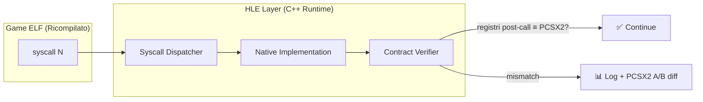
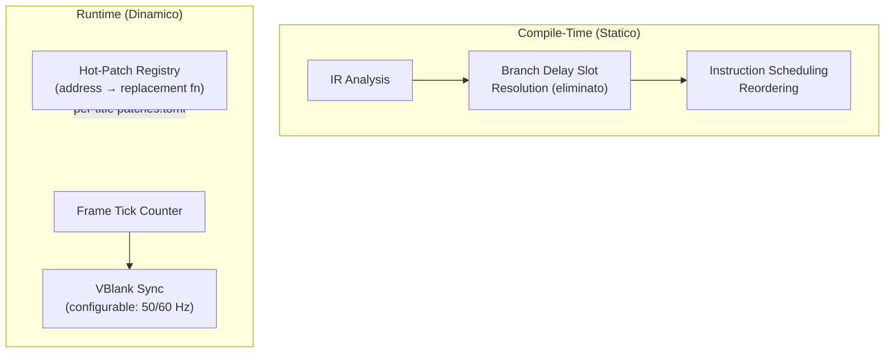

# PS2 Next-Gen Static Binary Translation Framework — Strategic Architecture

> **Codename**: PS2reAIcomp — IR-based Semantic Lifting Engine  
> **Target**: MIPS R5900 (EE) + R3000A (IOP) → x86-64 Windows  
> **Workspace**: `e:\Programmi VARI\PROGETTI\PS2reAIcomp`

---

## Part I: Risposte Strategiche al VETTORE 6

### Domanda 1: Gold Standard — Titolo PS2 per il primo test di ricompilazione completa

**Raccomandazione: Star Wars Episode III: Revenge of the Sith (SLES-531.55)**

Motivazione empirica basata su 9 fasi di reverse engineering completate:

| Criterio | SW EP3 Score | Note |
|----------|:---:|-------|
| Copertura ISA | ★★★★★ | MMI 128-bit, COP2 macro, FPU, DMA chain, VIF/GIF |
| Complessità overlay | ★★★★☆ | Launcher + COREC.BIN overlay a `0x7xxxxx` |
| PAK filesystem | ★★★★★ | 2× archive da 1.1GB, allocazione DMA pool, slot allocator |
| VTable dispatch | ★★★★☆ | Scene objects con vtable multi-level |
| DMA patterns | ★★★★☆ | Double-buffering, GIF PATH2, SPR transfers |
| Stato attuale | ★★★★★ | 30+ frame, boot completo, infrastruttura diagnostica pronta |

> [!IMPORTANT]
> Abbiamo già 9 fasi di fix applicati, 15 override/wrapper, e un'infrastruttura di logging matura. Questo ci dà un **baseline A/B testabile** contro PCSX2 per ogni funzione sollevata. Nessun altro titolo offre questo vantaggio.

**Secondo candidato** (per validazione cross-title): Un titolo con simboli DWARF — se disponibile — per validazione automatizzata della correttezza dei confini funzione.

---

### Domanda 2: Strategia BIOS Syscall — HLE vs Ricompilazione

**Raccomandazione: HLE (High-Level Emulation) con Contract Verification**



**Perché NON ricompilare il BIOS**:
1. Il BIOS PS2 è **firmware proprietario Sony** — non distribuibile, non modificabile
2. Il codice kernel usa **COP0 in modo privilegiato** (TLB, exception vectors, Status register) — mappare questo su x86-64 ring 0/3 è un problema di emulazione, non di traduzione statica
3. Le syscall sono un **contratto ABI stabile** (tabella fissa, [db-syscalls.md](file:///E:/Programmi%20VARI/PROGETTI/antigravity-awesome-skills/skills/ps2-recomp-Agent-SKILL/resources/db-syscalls.md) ne documenta 128+) — perfette per HLE
4. L'approccio PS2Recomp attuale funziona già — lo eleviamo a contratto formale

**Implementazione proposta**:
- Ogni syscall ha una **pre-condizione** (asserzione sui registri in ingresso) e **post-condizione** (registri in uscita)
- Le condizioni sono derivate da [db-syscalls.md](file:///E:/Programmi%20VARI/PROGETTI/antigravity-awesome-skills/skills/ps2-recomp-Agent-SKILL/resources/db-syscalls.md) e validate via PCSX2 MCP A/B testing
- Se una pre/post-condizione fallisce → log + dump registri per diagnosi

---

### Domanda 3: Hot-Patching per Bug di Timing

**Raccomandazione: Sì, ma con un framework strutturato, non patch ad-hoc**

Il problema è reale e documentato nel progetto attuale (Phase 4-9 del diary: 5+ crash causati da timing mismatch tra stack frame prologue/epilogue). La soluzione non è "patchare a caldo" ma implementare un **Timing Reconciliation Layer**:



**Componenti**:
1. **Frame limiter configurabile** — non legato a VBlank hardware ma a timer host
2. **Patch Registry** — `patches.toml` per titolo con `{address, replacement_fn, reason}`
3. **Timing probes** — contatori di cicli per funzione per identificare divergenze vs PCSX2

> [!TIP]
> Le patch di timing si scoprono durante la fase di verifica (PCSX2 A/B comparison), non preventivamente. Il framework deve renderle facili da applicare, non predirle.

---

### Domanda 4: Fedeltà SPU2 e Latenza Audio su Windows

**Raccomandazione: Fedeltà "Game-Accurate" con Backend WASAPI Exclusive**

| Livello | Latenza | Qualità | Complessità |
|---------|---------|---------|-------------|
| ❌ Bit-perfect | < 1ms | Identica a hardware | Impossibile senza emulazione ciclo-per-ciclo |
| ✅ **Game-Accurate** | ~10ms | Indistinguibile per il giocatore | Media — implementabile |
| ⚠️ Approssimata | ~50ms | Ritardi percepibili | Bassa |

**Implementazione**:
- **ADPCM decoder nativo** — il formato è documentato ([db-ps2-architecture.md](file:///E:/Programmi%20VARI/PROGETTI/antigravity-awesome-skills/skills/ps2-recomp-Agent-SKILL/resources/db-ps2-architecture.md) §7), decodifica in PCM 16-bit/48kHz
- **ADSR envelope generator** — riproduzione fedele delle 4 fasi (Attack, Decay, Sustain, Release) per ogni voce
- **Mixing a 48 voci** — 2 core × 24 voci, mixer stereo con effetti reverb semplificati
- **Backend**: WASAPI Exclusive Mode su Windows per latenza minima (~10ms)
- **NON implementare**: Reverb effect area completa (troppo costoso per v1.0), noise generator (raro), FM modulation (pochissimi giochi la usano)

---

## Part II: Architettura di Lifting Proposta

### Overview della Pipeline

```mermaid
graph TB
    subgraph FRONTEND["1. Frontend — Binary Analysis"]
        ELF["ELF Parser"]
        GHIDRA["Ghidra MCP\nRecursive Descent"]
        CFG["CFG Builder\n+ Jump Table\nResolver"]
        OVERLAY["Overlay\nDetector"]
    end
    
    subgraph LIFTER["2. Lifter — Semantic Translation"]
        DECODE["MIPS R5900\nInstruction\nDecoder"]
        IRGEN["IR Generator\n(Custom SSA)"]
        OPTPASS["Optimization\nPasses"]
        VERIFY_IR["Symbolic\nVerification"]
    end
    
    subgraph BACKEND["3. Backend — Code Generation"]
        X86GEN["x86-64\nCode Emitter"]
        REGALLOC["Register\nAllocator\n(128→AVX)"]
        SIMD["SIMD\nIntrinsic\nMapper"]
        PEEPHOLE["Peephole\nOptimizer"]
    end
    
    subgraph RT["4. Runtime — Hardware Abstraction"]
        KERNEL["Micro-Kernel\n(DMA, INTC,\nTimers)"]
        IOP_RT["IOP Emulation\n(SIF RPC)"]
        GS_RT["GS Renderer\n(Vulkan/D3D12)"]
        SPU2_RT["SPU2 Audio\n(WASAPI)"]
    end
    
    ELF --> GHIDRA
    GHIDRA --> CFG
    CFG --> OVERLAY
    OVERLAY --> DECODE
    DECODE --> IRGEN
    IRGEN --> OPTPASS
    OPTPASS --> VERIFY_IR
    VERIFY_IR --> X86GEN
    X86GEN --> REGALLOC
    REGALLOC --> SIMD
    SIMD --> PEEPHOLE
    PEEPHOLE --> RT
```



### 2.1 Frontend: Analisi Binaria Guidata da Ghidra

**Miglioramento chiave rispetto a PS2Recomp**: L'analizzatore attuale usa un euristica `jal` scanner che manca confini funzione per dual-entry points (Phase 3-4 del diary: 5+ crash). Il nuovo frontend usa **Ghidra MCP per analisi ricorsiva del flusso di controllo**:

```
Input: ELF binario (SLES_531.55 + COREC.BIN overlay)
   ↓
Ghidra MCP: functions_decompile() → CFG completo
   ↓
Jump Table Resolver: xrefs_list() + disassemble() → risolve tutti i jr $reg
   ↓
Dual-Entry Detector: identifica funzioni con più punti di ingresso
   ↓
Output: Function Map JSON con entry points, boundaries, call graph
```

**Risoluzione dei Jump Indiretti** (VETTORE 5, Parametro 3):
- **Fase 1**: Ghidra value-set analysis per `jr $t9` / `jr $ra`
- **Fase 2**: Constant propagation via data flow analysis (coppia `lui`/`ori` → target noto)
- **Fase 3**: Runtime fallback table per i jump irrisolvibili staticamente (< 2% dei casi tipici)

---

### 2.2 Lifter: IR Custom vs LLVM IR

> [!WARNING]
> **Decisione architetturale critica che richiede approvazione**

#### Opzione A: LLVM IR (vantaggi/svantaggi)

| Pro | Contro |
|-----|--------|
| Ottimizzazioni mature (DCE, CSE, LICM, GVN) | Overhead di linkage LLVM (~50MB librerie) |
| Backend x86-64 production-grade | Non modellare direttamente i 128-bit GPR PS2 |
| Community enorme | PS2 FPU non-IEEE richiederebbe custom intrinsics |
| JIT compilation possibile in futuro | Branch delay slots richiedono pre-processing |

#### Opzione B: Custom SSA IR (raccomandato)

| Pro | Contro |
|-----|--------|
| Modella nativamente 128-bit GPR come tipo first-class | Ottimizzazioni da scrivere da zero (subset) |
| Semantica PS2 FPU integrata (troncamento, no NaN) | Nessun backend x86 gratis — emit manuale |
| Branch delay slots risolti nel lifter | Meno testato di LLVM |
| Dimensioni del progetto controllate | — |
| Più veloce da iterare per il dominio specifico | — |

**Raccomandazione: Opzione B — Custom SSA IR con emissione C++**

Motivazione: Il progetto PS2Recomp attuale già emette C++ da MIPS. La differenza è che il codice emesso oggi è una traduzione 1:1 senza ottimizzazioni. Con un IR intermedio possiamo:
1. **Risolvere i branch delay slots** nel lifter (non nel codice emesso)
2. **Eliminare codice morto** (DCE) — molte funzioni PS2 hanno padding NOP
3. **Propagare costanti** — risolvere `lui + ori + jr` staticamente
4. **Fondere operazioni** — sequenze di `lw` consecutive → `lq` quando allineate
5. **Emettere C++ pulito** — leggibile, debuggabile, profilabile

**Formato IR proposto**:

```
; IR per: addiu $v0, $a0, 5
; poi: sw $v0, 0x10($sp)
%v0 = add.w %a0, 5
store.w %v0, [%sp + 0x10]

; IR per: lq $t0, 0($a0)  (128-bit load)
%t0 = load.q [%a0]

; IR per: paddw $t0, $t1, $t2  (parallel add 4×32)
%t0 = paddw %t1, %t2

; IR per branch delay slot:
; beq $a0, $zero, label
; addiu $v0, $zero, 1    ; delay slot
%v0 = add.w %zero, 1     ; delay slot PRIMA
br.eq %a0, %zero, @label ; branch DOPO
```

---

### 2.3 Mappatura 128-bit GPR → AVX

I registri R5900 sono **128-bit** (32 GPR × 128 bit). Su x86-64:

```
R5900 GPR[n] = struct { uint32_t words[4]; }  // 128-bit

Mappatura statica su __m128i (SSE2) o __m256i (AVX2 per coppie):

Registro MIPS     →  Registro x86 / Stack
─────────────────────────────────────────
$zero (r0)        →  costante 0 (eliminato)
$at (r1)          →  spill slot [rsp+0x00]
$v0-$v1 (r2-r3)  →  xmm0-xmm1 (ritorno + temp)
$a0-$a3 (r4-r7)  →  xmm2-xmm5 (argomenti)
$t0-$t3 (r8-r11) →  xmm6-xmm9 (estesi PS2)
$t4-$t7 (r12-r15)→  xmm10-xmm13
$s0-$s7 (r16-r23)→  stack-backed (callee-saved)
$t8-$t9 (r24-r25)→  xmm14-xmm15
$gp,$sp,$fp,$ra   →  stack-backed (strutturali)
```

**Operazioni MMI su AVX**:

| MIPS R5900 | x86 Intrinsic | Note |
|------------|---------------|------|
| `paddw` (4×32 add) | `_mm_add_epi32` | SSE2 diretto |
| `psubw` (4×32 sub) | `_mm_sub_epi32` | SSE2 diretto |
| `pmulth` (8×16 mul hi) | `_mm_mulhi_epi16` | SSE2 diretto |
| `pcpyld` (copy lower doubleword) | `_mm_unpacklo_epi64` | SSE2 |
| `pcpyud` (copy upper doubleword) | `_mm_unpackhi_epi64` | SSE2 |
| `pextlw` (extend lower words) | `_mm_unpacklo_epi32` | SSE2 |
| `pextuw` (extend upper words) | `_mm_unpackhi_epi32` | SSE2 |
| `lq` / `sq` (128-bit load/store) | `_mm_load_si128` / `_mm_store_si128` | Richiede allineamento 16B |
| `qfsrv` (funnel shift) | Custom (shift + OR) | Nessun intrinsic diretto |

---

### 2.4 FPU Non-IEEE: Strategia di Compliance

La FPU R5900 diverge da IEEE 754 in 5 modi critici. Ogni divergenza richiede un'intercettazione specifica:

| Divergenza R5900 | Impatto | Soluzione x86-64 |
|------------------|---------|-------------------|
| Denormals → 0 | Risultati diversi vicino a zero | `_MM_SET_FLUSH_ZERO_MODE(_MM_FLUSH_ZERO_ON)` + `_MM_SET_DENORMALS_ZERO_MODE(_MM_DENORMALS_ZERO_ON)` — **impostazione globale SSE** |
| Round-to-zero only | Troncamento vs arrotondamento banchiere | `_MM_SET_ROUNDING_MODE(_MM_ROUND_TOWARD_ZERO)` — **impostazione globale SSE** |
| NaN → `0x7FBFFFFF` | Confronti NaN producono risultati diversi | Post-filter inline: `if (isnan(result)) result = PS2_NAN;` |
| ±Inf → `±MAX_FLOAT` | Overflow produce infinito su x86 | Post-filter inline: `result = clamp(result, -MAX_FLT, MAX_FLT);` |
| Nessuna eccezione FP | SIGFPE su x86 | Mascherare tutte le eccezioni FP SSE (default su Windows) |

> [!NOTE]
> Le prime 2 divergenze si risolvono con **un'unica chiamata** a `_mm_setcsr()` all'inizio del programma. Le altre richiedono wrapper inline che il lifter può inserire automaticamente nei punti FPU del IR.

---

### 2.5 Branch Delay Slots: Risoluzione Statica

La strategia è **risolvere i delay slot nel lifter**, non nel codice emesso:

```
MIPS assembly:
    beq  $a0, $zero, target
    addi $v0, $zero, 1    ; delay slot — eseguito COMUNQUE

IR dopo lifting:
    %v0 = add.w %zero, 1      ; delay slot spostato PRIMA del branch
    br.eq %a0, %zero, @target  ; branch senza delay slot

C++ emesso:
    ctx.gpr[2].words[0] = 1;   // delay slot
    if (ctx.gpr[4].words[0] == 0) goto target;
```

Per `branch-likely` (delay slot nullificato se branch non preso):
```
IR:
    br.likely.eq %a0, %zero, @target {
        %v0 = add.w %zero, 1   ; esecuzione condizionale
    }

C++ emesso:
    if (ctx.gpr[4].words[0] == 0) {
        ctx.gpr[2].words[0] = 1;  // solo se branch preso
        goto target;
    }
```

---

### 2.6 Self-Modifying Code & Overlay

**Self-Modifying Code (SMC)**: Raro su PS2 per il codice di gioco (la I-Cache lo rende problematico anche su hardware reale). Se presente:
- Rilevamento: scan per `sw` che scrive in regioni `.text` → flag nella function map
- Soluzione: funzione fallback interpretata (non ricompilata) con JIT on-demand

**Overlay**: Comune (SW EP3 usa COREC.BIN come overlay a `0x7xxxxx`):
- Il frontend analizza ogni overlay come binario separato
- Il lifter genera C++ separato per ogni overlay
- Il runtime gestisce il caricamento/scaricamento dinamico delle function tables

---

## Part III: Piano di Verifica

### Test Automatizzati

1. **Unit Test per il Lifter**: Per ogni istruzione R5900 supportata, test che verifica la traduzione IR corretta
   - Comando: `ctest --test-dir build64 -R lifter_*`
   - Copertura target: tutte le 200+ istruzioni R5900

2. **Test di Equivalenza Semantica**: Per ogni funzione sollevata, confronto registri PCSX2 vs codice ricompilato
   - Usa PCSX2 MCP: breakpoint su entry → dump registri → esegui versione ricompilata → confronta
   - Comando: `python scripts/semantic_equivalence_test.py --function 0x12FFD0`

3. **Test di Regressione SW EP3**: Le 9 fasi di fix già validate devono continuare a passare
   - Comando: `cmd.exe /c "run_game_agent.bat" 15` → verifica 30+ frame tick nel log

### Verifica Manuale

1. **Ispezione visiva del C++ emesso**: Il codice generato dal nuovo lifter deve essere più leggibile del pattern-matching attuale
2. **A/B comparison**: Su funzioni critiche (PAK init, scene constructor, vtable dispatch), confronto output PCSX2 vs ricompilato

---

## Part IV: Struttura del Progetto

```
PS2reAIcomp/
├── CMakeLists.txt              # Root build
├── src/
│   ├── frontend/               # ELF parser, Ghidra integration, CFG builder
│   │   ├── elf_parser.cpp
│   │   ├── ghidra_bridge.cpp
│   │   ├── cfg_builder.cpp
│   │   └── jump_resolver.cpp
│   ├── lifter/                 # MIPS → IR → optimized IR
│   │   ├── decoder.cpp         # R5900 instruction decoder
│   │   ├── ir.h                # IR types (SSA nodes)
│   │   ├── ir_gen.cpp          # MIPS → IR translation
│   │   ├── passes/             # Optimization passes
│   │   │   ├── dce.cpp         # Dead Code Elimination
│   │   │   ├── const_prop.cpp  # Constant Propagation
│   │   │   ├── delay_slot.cpp  # Branch Delay Slot Resolution
│   │   │   └── simd_fold.cpp   # SIMD operation folding
│   │   └── verify.cpp          # Symbolic equivalence checker
│   ├── backend/                # IR → C++/x86
│   │   ├── cpp_emitter.cpp     # Generate clean C++ from IR
│   │   ├── reg_alloc.cpp       # 128-bit → AVX register allocation
│   │   └── simd_mapper.cpp     # MMI → SSE/AVX intrinsic mapping
│   ├── runtime/                # Hardware abstraction layer
│   │   ├── kernel.cpp          # DMA, INTC, timers
│   │   ├── memory.cpp          # RDRAM, scratchpad, address masking
│   │   ├── iop.cpp             # IOP emulation (SIF RPC)
│   │   ├── gs.cpp              # GS renderer stub (Vulkan/D3D12)
│   │   ├── spu2.cpp            # Audio (ADPCM + WASAPI)
│   │   └── syscall_hle.cpp     # BIOS syscall HLE
│   └── main.cpp                # CLI entry point
├── include/
│   └── ps2reaicomp/            # Public headers
├── tests/
│   ├── lifter/                 # Per-instruction unit tests
│   ├── integration/            # Full function lift+run tests
│   └── regression/             # SW EP3 regression suite
├── scripts/
│   ├── semantic_equivalence_test.py
│   └── ghidra_export.py
└── docs/
    └── architecture.md
```

---

## MANIFESTO OPERATIVO

1. **Nessuna istruzione è tradotta senza verifica** — ogni operazione R5900 ha un test unitario che confronta il risultato con PCSX2
2. **Il lifter non è un pattern-matcher** — è un compilatore che comprende la semantica, non la sintassi
3. **Il codice morto è il nemico** — DCE, constant propagation e register coalescing sono non-negoziabili
4. **Il runtime è un contratto** — ogni syscall ha pre/post-condizioni documentate e testate
5. **Il branch delay slot non esiste nel C++** — è risolto nel lifter, period
6. **La FPU PS2 non è IEEE 754** — e il lifter lo sa
7. **Il progetto è costruito per essere leggibile** — il C++ emesso deve essere comprensibile da un umano
8. **Nessun codice generato è modificato a mano** — le fix vanno nel lifter o nel runtime, mai nell'output
9. **PCSX2 è l'oracolo** — ogni divergenza è un bug nel framework, non nel gioco
10. **La velocità di build è un requisito** — Ninja + clang-cl, sempre
